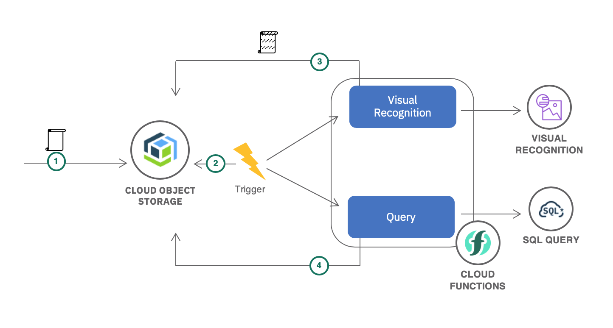
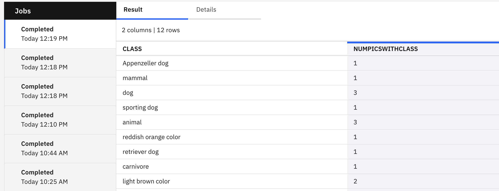

# Leverage Cloud Object Storage Triggers with SQL Query to Analyze your Data

## Summary
In this application, you upload an image to a web application that is stored in IBM Cloud Object Storage, which triggers your serverless function to run and do some image analysis to determine what is in the image.  These results will be stored into a different Cloud Object Storage bucket, which will trigger your SQL Query functions to be run. The query will aggregate the various classes or tags found in all of the images.


## Architecture
   

## Instructions
### Prerequisites
1. An [IBM Cloud Account](https://cloud.ibm.com/register)
1. An [IBM Cloud CLI](https://cloud.ibm.com/docs/cli/reference/ibmcloud?topic=cloud-cli-install-ibmcloud-cli#install_use) with the IBM Cloud Functions [Plugin](https://cloud.ibm.com/docs/openwhisk?topic=cloud-functions-cli_install) installed.

### Create Required Services on IBM Cloud
To run this application, you'll need to set up Object Storage, the Visual Recognition Service on IBM Cloud, and SQL Query on IBM Cloud.
1. Create a Cloud Object Storage Service Instance:
    * From the catalog select [Object Storage](https://cloud.ibm.com/catalog/services/cloud-object-storage).
    * Give your service a name, and click `Create`.
    * In the left side menu, select `Buckets`, and then `Create bucket`.
    * Give your bucket a unique name. 
    * For Resiliency, select `Regional`, and for Location, select `us-south`. *Note: This trigger is currently available in us-south, us-east, and eu-gb regions. You could select one of the other available regions, but our examples will use us-south*
    * Click `Create Bucket`.
    * Create another bucket, with the same name suffixed by `-processed`. If your original bucket was `my-bucket`, then your new bucket will be `my-bucket-processed`.
    * Again, ensure that you selected the same region as your first bucket, in this case `Regional` and `us-south`.
    * Create one more bucket, this one will be for your SQL Query results. You can name it something like `sql-query-results`.
    * Again, ensure that you selected the same region as your first bucket, in this case `Regional` and `us-south`.
    * In the left side menu, click `Service Credentials`. Click `New Credential`.
    * Check the checkbox for `Include HMAC Credential`. Click `Add`.

1. Create a Visual Recognition Service Instance
    * From the catalog select [Visual Recognition](https://cloud.ibm.com/catalog/services/visual-recognition)
    * Give your service a name, and click `Create`.
    * In the left side menu, click `Service Credentials`. If there are no service credentials created, click `New Credential`. Once your Service Credentials are created, make note of your `apikey`.

1. Create a SQL Query Service Instance
    * From the catalog select [SQL Query](https://cloud.ibm.com/catalog/services/sql-query)
    * Select a region, we will use `Dallas`.
    * Give your service a name, and click `Create`.
    * Make note of the value for `CRN`.
  

### Login and set up your IBM Cloud CLI with Functions plugin
1. Login to the IBM Cloud CLI:
    ```
    ibmcloud login
    ```

1. List the namespaces available in IBM Cloud Functions:
    ```
    ibmcloud fn namespace list
    ```

1. Set your desired namespace using the ID found in the previous step:
    ```
    ibmcloud fn property set --namespace <namespace_id>
    ```

### Create Required IAM Policy for Cloud Functions to Access Cloud Object Storage
1. Before you can create a trigger to listen for bucket change events, you must assign the Notifications Manager role to your Cloud Functions namespace. As a Notifications Manager, Cloud Functions can view, modify, and delete notifications for a Cloud Object Storage bucket. 
    ```
    ibmcloud iam authorization-policy-create functions cloud-object-storage "Notifications Manager" --source-service-instance-name <functions_namespace_name> --target-service-instance-name <cos_service_instance_name>
    ```

### Deploy the SQL Query and Cloud Object Storage Packages
We'll deploy two packages containing already created actions that we can use to interact with our Cloud Object Storage and SQL Query instances.

1. You should have already made note of your instance crn from SQL Query.  If not, you can find it on the SQL Query instance page. Once you have this value, create an environment variable for it:
    ```
    export INSTANCE_CRN=<your_instance_crn>
    ```

1. SQL Query requires an IAM token to be used when making API calls. Since IAM tokens expire after 60 minutes, it's advised to create an API Key that will be used to generate an IAM token when the functions run. The API key will be saved during package deployment. Create the API Key for your own personal identity, copy the key value, and save it in a secure place:
    ```
    export API_KEY=`ibmcloud iam api-key-create sql-query-key -d 'apiKey created for http://github.com/IBM-Cloud/openwhisk-sql-query' | grep 'API Key' | awk ' {print $3} '`
    ```

1. Clone the SQL Query Package Repo:
    ```
    git clone https://github.com/IBM-Cloud/openwhisk-sql-query.git
    ```

1. Change directories into the openwhisk-sql-query folder you just cloned:
    ```
    cd openwhisk-sql-query
    ```

1. Deploy the package using `ibmcloud fn deploy`. This command will look for a `manifest.yaml` file defining a collection of packages, actions, triggers, and rules to be deployed.
    ```
    ibmcloud fn deploy --param instance_crn $INSTANCE_CRN --param apiKey $API_KEY
    ```

### Bind required service credentials to the Cloud Object Storage package
The SQL Query package relies on the Cloud Object Storage package, and has installed it as a dependency. To use the COS package, we will have to bind credentials to the package.

1. You will need to save the endpoint name, which is the COS Endpoint for your buckets. Since you selected us-south when selecting your buckets, the endpoint should be `s3.us-south.cloud-object-storage.appdomain.cloud`.
    ```
    export ENDPOINT=s3.us-south.cloud-object-storage.appdomain.cloud  
    ```
*Note: If you selected a different region, you can find your endpoint by clicking your Cloud Object Storage service in the [Resource list](https://cloud.ibm.com/resources?groups=storage), finding your bucket in the list, and then looking under Configuration for that bucket. Use the public endpoint.*

1. Let's update the package with your endpoint information.
    ```
    ibmcloud fn package update cloud-object-storage --param endpoint $ENDPOINT
    ```
1. Bind your already created credentials to the Cloud Object Storage package:
    ```
    ibmcloud fn service bind cloud-object-storage cloud-object-storage --instance <your COS instance name>
    ```

1. Congratulations, you've created a Cloud Object Storage and SQL Query package with actions you can now use!

### Create Required Environment Variables and Deploy Cloud Functions
To deploy the rest of the functions required in this application, we'll use the `ibm fn deploy` command again.

1. Let's clone the application, and change directories.
    ```
    git clone git@github.com:IBM/openwhisk-sql-query.git
    cd cos-fns-sql-query
    ```

1. Take a look at the `serverless/manifest.yaml file`. You should see a manifest describing the various actions, triggers, packages, and sequences to be created. You will also notice that there are a number of environment variables you should set locally before running this manifest file.

1. Choose a package name, two trigger names, and two rule names and then save the environment variables.  *Note: The package you will create will hold all of the actions for this application.*
    ```
    export PACKAGE_NAME=<your_chosen_package_name>
    export TRIGGER_NAME_NEW=<your_chosen_trigger_name>
    export TRIGGER_NAME_PROCESSED=<different_chosen_trigger_name>
    export RULE_NAME_NEW=<your_chosen_rule_name>
    export RULE_NAME_PROCESSED=<different_chosen_rule_name>
    ```

1. You already chose a few bucket names earlier when creating your COS Instance. Save those names as the following environment variable:
    ```
    export BUCKET_NAME=<your_bucket_name>
    export BUCKET_NAME_PROCESSED=<your_bucket_name_processed>
    export SQL_RESULTS_BUCKET=<your_sql_results_bucket_name>
    ```

1. You will also need to tell SQL Query where to place the results of the sql query it will run to aggregate and process the visual recognition class data. The value will be of the format: `cos://<your region>/<your_bucket_name>.
    ```
    export SQL_RESULTS_TARGET=cos://us-south/$SQLRESULTS_BUCKET
    ```

1. Finally, you will need some information from the Visual Recognition service.  You saved your apikey earlier, so use that. This application is built against the version released on `2018-03-19`, so we'll use that value for VERSION.
    ```
    export VR_API_KEY=<your_visual_recognition apikey>
    export VERSION=2018-03-19
    ```

1. You've set up some required credentials and various parameters for your IBM Cloud Functions. Let's deploy the functions now! Change directories to the `serverless` folder, and then deploy the functions.
    ```
    cd serverless
    ibmcloud fn deploy
    ```

1. Congratulations! If you went directly to your cloud object storage bucket and added a file, you should see your trigger fire and some processed actions showing up in your `mybucket-processed` bucket. Another trigger will then fire, causing the SQL Query to run and aggregate the results. Let's try it out!

### Try out your new actions
1. Go to your Cloud Object Storage instance in the UI for IBM Cloud. You can find it in the [resources list](https://cloud.ibm.com/resources).

2. Click on your `my-images` bucket. You may have named it something different. Drag an image into this bucket from your computer.

3. Click Buckets on the left side menu, and go to your `my-images-processed` bucket. You should see a `.json` file containing the information returned from the Visual Recognition service.

4. When the `.json` file was added to this `-processed` bucket, a trigger was fired to run a SQL query. The SQL Query will aggregate all of the classes across these json files, so you can tell what types of images you have the most of in your database.
    ```
    WITH explode_classes as (SELECT id, explode(classes) theclass FROM cos://us-south/my-images-bmv-processed STORED AS JSON) SELECT theclass.class, COUNT(id) as NumPicsWithClass FROM explode_classes GROUP BY theclass.class
    ```
5. Let's go see the SQL query results. Click Buckets on the left side menu, and go to your `sql-query-results` bucket. There should be a file ending in _csv, which contains the results of the SQL query!  

6. You can also find the results of the SQL query in your SQL query instance:
  
    1. Go to the [resources list](https://cloud.ibm.com/resources), and click on your SQL query instance.
    2. Launch the SQL query UI using the button in the upper right hand corner of the page.
    3. Under `Jobs`, click the most recently Completed query.
    4. You should be able to see the Results, which will look something like this:
      
    5. As you can see, we uploaded some photos of dogs, and have 3 images with the class `dog`, 3 images with the class `animal`, and 1 image with the class `sporting dog`.


6. It's possible that once you get your aggregated results, you want to continue to do some processing in IBM Cloud Functions. To that end, we've included an IBM Cloud Functions action to read this query result. You can see the results of that in the IBM Cloud Functions Monitor tab.

    1. Go to IBM Cloud Functions [Monitor tab](https://cloud.ibm.com/functions/dashboard).

    2. Here, you can see all of your actions run. The most recent one should be called `openwhisk-sql-query/result-set`. Click the activation id for this action, and you can view the results in the response body.  

    3. You could now do some additional processing on this information using your IBM Cloud Functions!